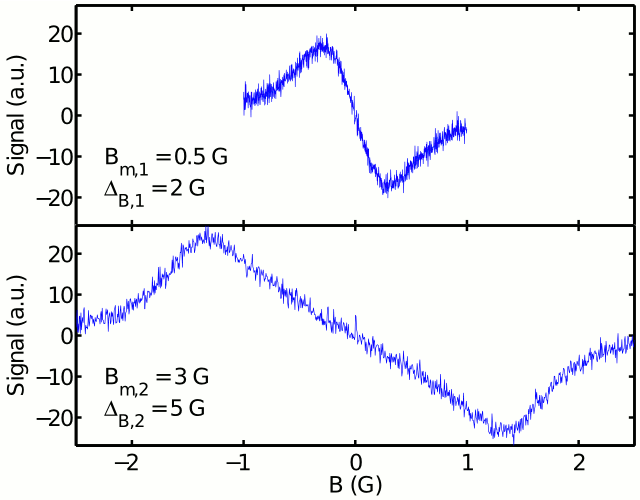

# dual-scan_acquisition

This is the code and data needed to reproduce the figures in the following
paper:

J Palmer, LC Potter, DH Johnson, JL Zweier, R Ahmad. "Dual-scan acquisition for
accelerated continuous-wave EPR oximetry." Journal of Magnetic Resonance, 2012.
[DOI][DOI] | [PubMed][PubMed] | [PubMed Central][PubMed Central]

[DOI]: https://dx.doi.org/10.1016/j.jmr.2012.05.021
[PubMed]: https://www.ncbi.nlm.nih.gov/pubmed/22820009
[PubMed Central]: https://www.ncbi.nlm.nih.gov/pmc/articles/PMC3423522

## Instructions

To reproduce the desired figure, call the corresponding function (e.g.
`figure_2`) in MATLAB or Octave. This will produce the figure in a new figure
window and save it as an EPS file (e.g. `figure_2.eps`).

Production of some figures requires MATLAB's optimization toolbox or Octave's
optim package.

## Results

The figures produced by running this code in MATLAB 2011b are shown below. (No
post-processing has been done. See the paper for the final edited versions.)

### Figure 1

### Figure 2

### Figure 3

### Figure 4

### Figure 5

### Figure 6

### Figure 7

## License

This program is free software: you can redistribute it and/or modify it under
the terms of the GNU General Public License as published by the Free Software
Foundation, either (at your option) version 2 or version 3 of the License.

This program is distributed in the hope that it will be useful, but WITHOUT ANY
WARRANTY; without even the implied warranty of MERCHANTABILITY or FITNESS FOR A
PARTICULAR PURPOSE. See the GNU General Public License for more details.

You should have received a copy of the GNU General Public License along with
this program. If not, see https://www.gnu.org/licenses/
